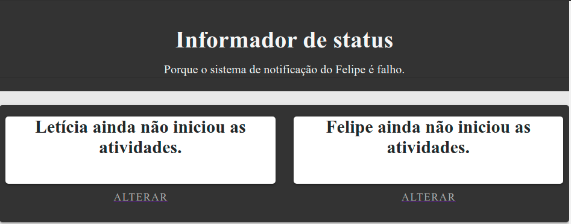
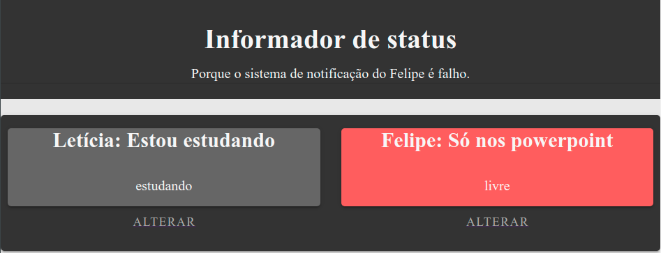

# Compartilhador-de-atividades
# PROJETO EM CONSTRUÇÃO

## O que é este projeto?
Esse projeto atende uma necessidade específica minha e se baseia em uma single page application (SPA) web desenvolvida em Vue que pode ser acessada através da rede local. Nessa página, tanto eu como meu irmão podemos colocar se estamos ocupados ou não (em aula/trabalhando/em reunião) para informar que não devemos ser incomodados.

## Como este projeto funciona?
Este projeto está dividido em duas partes, sendo a primeira uma aplicação front-ent desenvolvida em Vue, que será rodada localemente através do servidor de desenvolvimento, e a segunda parte um servidor que armazena os dados.

A aplicação front-ent roda na porta 8080 da máquina enquanto o servidor que armazena dos dados roda na porta 8081, de modo que você precisa que ambas as portas estejam livres na sua máquina antes de rodar a aplicação, caso contrário a aplicação encontrará problemas. 

## Como utilizar este projeto?
Primeiro de tudo, você precisa ter o node instalado na sua máquina. Depois de se certificar que essa dependência existe, você tem que fazer o download do projeto, o que pode ser feito por meio de um arquivo zip ou utilizando o comando `git clone https://github.com/LelePG/Compartilhador-de-atividades`. Depois de baixado (e descompactado se você tiver o feito o download por meio do arquivo zip), abra a pasta fonte do projeto e entre na pasta **app**. 

Antes de rodar a aplicação, você precisa fazer uma alteração no arquivo **ip.js** localizado em **/app/router**, subsituindo o valor da constante **ip** e substituir pelo ip da sua máquina. Depois dessa alteração, basta salvar o arquivo **ip.js** e rodar o comando `npm i` para baixar as dependências do projeto e `npm start` para iniciar a aplicação.

O servidor que armazena as informações começará a rodar na porta 8081, enquanto o servidor do front-end rodará na porta 8080, e para acessar a aplicação na sua máquina, você pode acessar a aplicação pelo endereço **http://localhost:8080** e na rede local pelo endereço **http://SEU_IP:8080**.

Uma vez acessado, você pode modificar o status de um determinado usuário clicando no botão *aletrar* abaixo do card que representa o status daquele usuário. Uma vez que tenha clicado em alterar você será redirecionado para outra tela onde pode escolher a mensagem que vai aparecer no card e o status do usuário. Após isso, basta clicar em **modificar** para que as modificações sejam persisitidas para o servidor de armazenamento de dados.

A tela inicial ainda conta com um botão de recarregar que serve para recarregar a página e verificar o status do outro usuário já as alterações feitas em uma máquina não são aplicadas em tempo real para as demais máquinas conectadas.

## Quais tecnologias foram usadas no desenvolvimetno deste projeto?
Basicamente o projeto é todo em Javascript, sendo que utiliza o framework Vue para a criação do front-end, em conjunto com Vuetify para criar os elementos gráficos, e o servidor que mantém as informações é desenvolvido em node, tendo express e cors como dependências.

## Como este projeto está estruturado?
A pasta app contém todo o código da aplicação, sendo que o servidor que armazena as informações se encontra na pasta **back**, enquanto a pasta **src** contém o front-end da aplicação, possuindo algumas sub-pastas importantes:

- components: contém os componentes básicos
- paginas: contém os componentes que representam as páginas que serão renderizadas na aplicação principal
- router: contém o router responsável dela renderização das páginas e o arquivo que guarda o valor do ip da máquina.

## Links úteis
- [Paleta de cores da aplicação](https://coolors.co/f6f6f6-e8e8e8-333333-990100-b90504)
- [Vuetify](https://vuetifyjs.com/en/)

